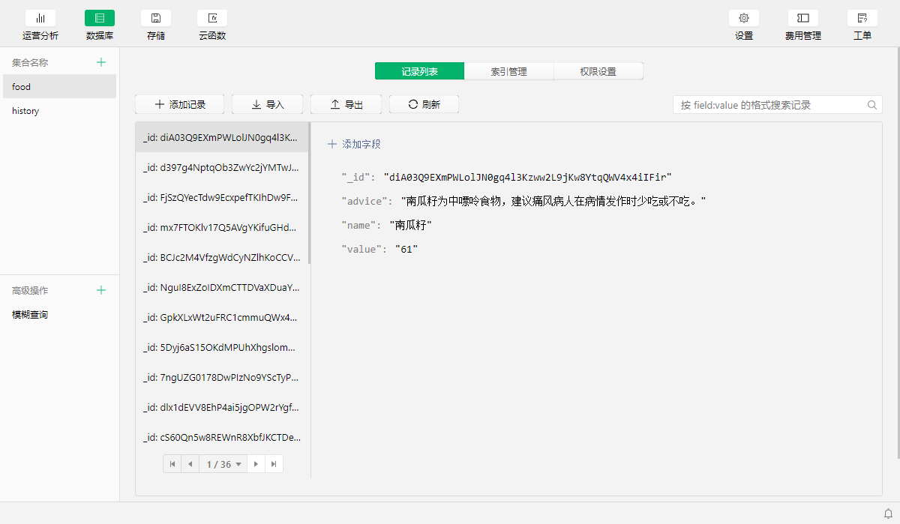
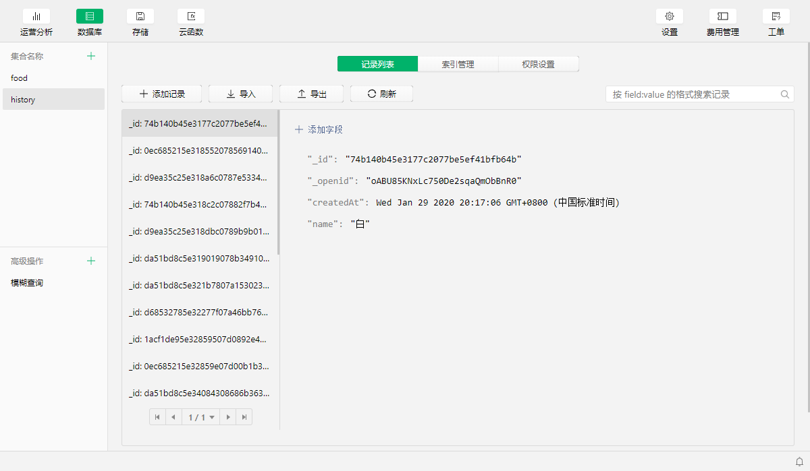

# 食物嘌呤含量小程序

## 技术
微信原生 + 云开发

## 小程序码


## 开发日志

 - 2020.1.24 初始化
 - 2020.1.25 爬取数据
 - 2020.1.28 首页
 - 2020.1.29 查询页
 - 2020.1.31 上线


## 截图


## 宣传海报


## 云开发数据格式



## 爬虫示例

```js
const cheerio = require('cheerio')
const gotIconv = require('got-iconv')
const tunnel = require('tunnel')
const mysql = require('mysql2/promise')

const BASEURL = Buffer.from('aHR0cDovL3d3dy5nZDIwNjMuY29tL3Bs','base64').toString()
// 获取内容页url
async function getContentUrls(conn) {
  const res = await gotIconv(BASEURL + '/more.asp', {
    'User-Agent': 'Mozilla/5.0 (Windows NT 10.0; Win64; x64) AppleWebKit/537.36 (KHTML, like Gecko) Chrome/91.0.4472.114 Safari/537.36 Edg/91.0.864.59'
  })
  const $ = cheerio.load(res.body)
  $('#main-left > a').each(async (i, el) => { 
    const url = BASEURL + $(el).attr('href').split('.')[1]
    await conn.query('INSERT INTO data SET ?', { url })
  })
}

// 获取代理ip
async function getProxyIp() {
  // 本地运行的ip池
  const res = await gotIconv('http://localhost:5010/get/')
  return res.body.proxy
}

// 获取数据
async function getData(url) {
  const res = await gotIconv(url, {
    'User-Agent': 'Mozilla/5.0 (Windows NT 10.0; Win64; x64) AppleWebKit/537.36 (KHTML, like Gecko) Chrome/91.0.4472.114 Safari/537.36 Edg/91.0.864.59',
    agent: {
      // 配置http代理
      https: tunnel.httpsOverHttp({
        proxy: 'http://' + await getProxyIp()
      })
    }
  })
  const contentArr = []
  const $ = cheerio.load(res.body)
  $('#main-left > p').each((i, el) => {
    if (i <= 4) {
      const textArr = $(el).text().split('：')
      let text = textArr[1]
      if (textArr.length > 2) {
        textArr.splice(0, 1)
        text = textArr.join('：')
      }
      contentArr.push(text)
    }
  })
  return {
    name: contentArr[0],
    value: contentArr[1].split('mg')[0],
    type: contentArr[2],
    level: checkLevel(contentArr[3]),
    advice: contentArr[3],
    info: contentArr[4]
  }
}


;(async () => {
  try {
    // create the connection to database
    const conn = await mysql.createConnection({
      host: 'localhost',
      user: 'root',
      password: 'root',
      database: 'plspider'
    })
    await getContentUrls(conn) // 如果断点续爬, 可以需要注释掉这个
    // 从数据库获取内容页url
    const urlsRes = await conn.query(`select url from data`)
    const urls = urlsRes[0]
    for (let i = 0, len = urls.length; i < len; i++) {
      const currentUrl = urls[i].url
      // 查询当前url是否存在数据, 不存在才进行爬取
      const check = await conn.query(`select name from data where url='${currentUrl}'`)
      if (!check[0][0].name) {
        await sleep()
        const obj = await getData(currentUrl)
        conn.query(`UPDATE data SET ? WHERE url='${currentUrl}'`, { ...obj })
        console.log('获取: ' + obj.name)
      }
    }
    console.log(' ========================== 完成 ==========================')
  } catch (error) {
    console.log(error)
  }
})()

// 嘌呤级别判断
function checkLevel(advice) {
  if (advice.indexOf('高嘌呤') !== -1) {
    return 2
  } else if (advice.indexOf('中嘌呤') !== -1) {
    return 1
  } else if (advice.indexOf('低嘌呤') !== -1) {
    return 0
  }
  return ''
}

// 睡眠函数
async function sleep() {
  return new Promise(resolve => {
    setTimeout(() => {
      resolve()
    }, 500)
  })
}
```
